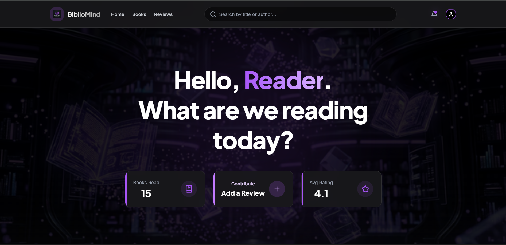
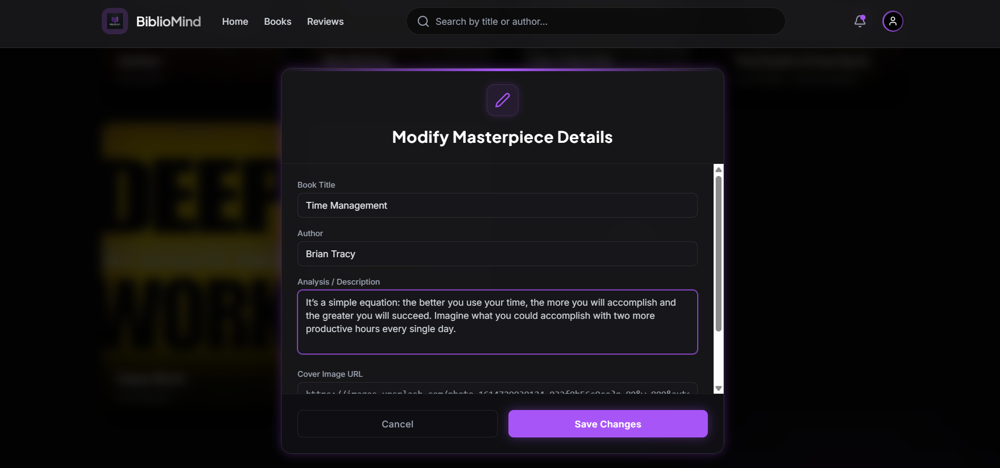
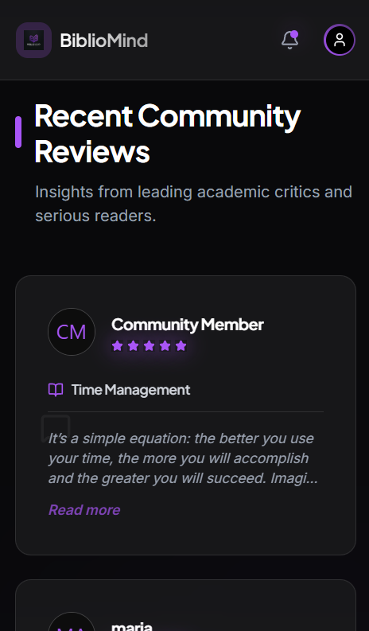

<div align="center">

# BiblioMind
**A Curated Dark Luxury Book Review Platform & AI-Ready Ecosystem.**



<br />


BiblioMind is a full-stack, aesthetically-driven web application designed for discerning readers and literary critics. It provides a highly curated, "Dark Luxury" environment to discover, review, and analyze masterpieces.

</div>

---

## Live Demo
Experience the platform here: **[BiblioMind - Live Application](https://biblio-mind.vercel.app)**

---

## Key Features

- **Robust Authentication:** Secure JSON Web Token (JWT) based login and registration system.
- **Data Management (Full CRUD):** Seamlessly create, read, update, and delete Book listings and User Reviews dynamically without page reloads.
- **Real-time Discovery:** Instant client-side search filtering across the book matrix by Title and Author strings.
- **Ownership Protection (RBAC):** UI controls for Edit and Delete operations are strictly gated via JWT user token validation. Guests can only view; Owners can modify.
- **Dark Luxury Aesthetic:** State-of-the-art "Glassmorphism" UI design utilizing deep blacks and vibrant purple accents, fully responsive across all devices.

---

##  UI Showcases

| Modification Interface | Mobile Experience |
| :---: | :---: |
|  |  |

---

## Technical Challenges & Solutions

### 1. The Layout Spill Issue (CSS Dimension Clamping)
**Challenge:** Initially, excessively long text inputs for Book Titles and Descriptions caused the `BookCard` components to vertically erupt. The text spilled outside the glassmorphism boundaries, snapped the flex grid layout, and buried critical UI buttons beneath the screen margin.
**Solution:** I rebuilt the card matrices by injecting precise `line-clamp-2` (Title) and `line-clamp-4` (Body) Tailwind properties, combined with a rigid `flex-grow mb-auto` wrapper and `overflow-hidden` constraints. The text now intelligently truncates and organically consumes *only* available vertical space.

### 2. Ephemeral State Erasure (Auth Persistence)
**Challenge:** The frontend maintained authentication purely within standard local React state. Consequently, navigating away or triggering a browser refresh instantaneously wiped the active session.
**Solution:** Secured the Authentication architecture by anchoring the active session to the browser's persistent storage. Upon a successful Django handshake, the JSON `user_data` and encrypted API `token` are aggressively cached. An `App.jsx` `useEffect` interceptor sniffs for these records before the initial render loop, instantly rebuilding the authorized state tree upon every refresh.

### 3. Advanced UI State Management & Modal Isolation
**Challenge:** Interactive forms (like the Edit/Delete modals) were rendering inline, disrupting the document flow and pushing content down on mobile views.
**Solution:** Engineered complex floating modals using absolute fixed positioning (`fixed inset-0 z-[9999]`) to break out of standard document flow. Implemented isolated container scrollbars for long textareas, ensuring zero layout shifts across the application regardless of content size.

---

## Future AI Roadmap

- [ ] **NLP Sentiment Analysis:** Integrate a Natural Language Processing model to automatically analyze and score the tone of community reviews.
- [ ] **Smart Recommendations:** Develop an AI-driven engine to suggest books based on a user's reading history and rating patterns.

---

##  Installation & Local Setup

### Prerequisites
- Python 3.10+
- Node.js & npm
- PostgreSQL (Optional, defaults to SQLite locally)

### 1. Backend Configuration (Django)
Navigate to the backend directory and setup the virtual environment: 
```bash
cd backend
python -m venv venv
source venv/bin/activate  # On Windows: venv\Scripts\activate
pip install -r requirements.txt
```

Create a `.env` file in the backend directory with the following variables:
```env
SECRET_KEY=your_django_secret_key
DEBUG=True
ALLOWED_HOSTS=localhost,127.0.0.1
CORS_ALLOWED_ORIGINS=http://localhost:5173,http://127.0.0.1:5173
```

Run migrations and start the server:
```bash
python manage.py migrate
python manage.py runserver
```

### 2. Frontend Configuration (React/Vite)
Navigate to the root directory (where the React code is) in a new terminal:
```bash
npm install
```

Create a `.env` file in the root of the frontend directory:
```env
VITE_API_URL=http://127.0.0.1:8000
```

Start the development server:
```bash
npm run dev
```

---

## Author
**Oliver**  
*Full Stack Web Developer*  
Aesthetic & Philosophy: Dark Luxury Tech | Solution-oriented design.